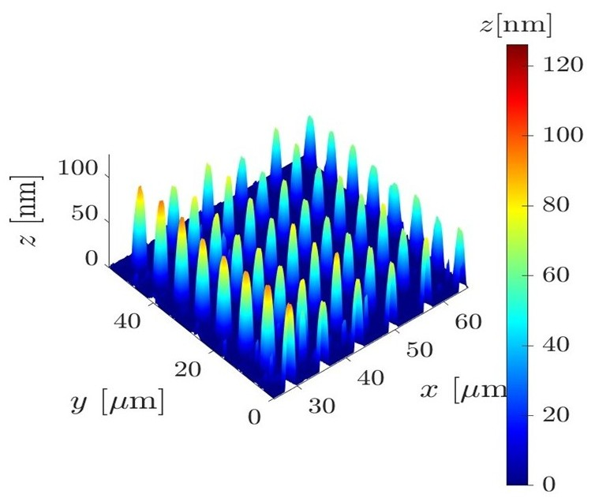
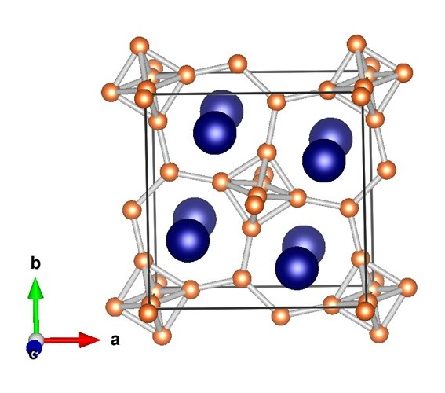
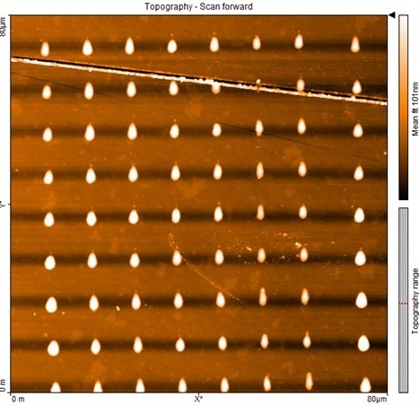

<!-- ===================== GLOBAL UI THEME ===================== -->

<!-- ===================== HERO HEADER ===================== -->

  
  
Krishna Kumar Yadav

<!-- ===================== NAVIGATION (ALL LINKS CLICKABLE) ===================== -->

  <a href="/">🏠 Home</a> |
  <a href="/experience/">👨‍🔬 Experience</a> |
  <a href="/instrumentation/">🔬 Instrumentation</a> |
  <a href="/impact/">📈 Impact</a> |
  
    <a class="dropdown-toggle">📚 Publications ▾</a>
    
      <a href="/patents/">1. Patents</a>
      <a href="/Book_Chapters/">2. Book Chapters</a>
      <a href="/publications/">3. Peer‑Reviewed Journal Articles</a>
    
   |
  <a href="/contact/">📬 Contact</a>

---

# Dr. Krishna Kumar Yadav 
### Post-Doctoral Fellow | University of Salamanca, Spain 🇪🇸 

---

## Welcome
Welcome to my professional academic website. I am a physicist specializing in Nanotechnology, Energy, Device Fabrication, and Advanced Material Synthesis, with a particular focus on Metal hexaboride. I am a proactive learner, constantly integrating modern tools like **Artificial Intelligence** to accelerate scientific discovery and automate data analysis.

---

### 📸 Research & Lab Gallery

<table style="border: none; border-collapse: collapse;">
<tr>
<td style="padding: 10px; border: none;"></td>
<td style="padding: 10px; border: none;"></td>
</tr>
<tr>
<td style="padding: 10px; border: none;"></td>
<td style="padding: 10px; border: none;"></td>
</tr>
</table>

---

### 📍 Current Focus
Currently advancing the characterization of two‑dimensional (2D) transition metal dichalcogenides (TMDs), establishing a scalable platform for Schottky barrier quantification using KPFM, and fabricating Schottky‑junction solar cells at the **University of Salamanca**, Spain.

---
📧 **Contact:** krish91phy@usal.es | <a href="https://scholar.google.com/citations?user=DsDWPX4AAAAJ&hl=en" target="_blank" rel="noopener">🎓 Google Scholar</a>
